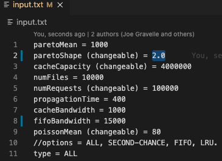
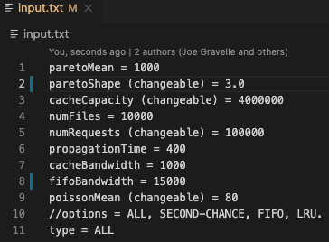
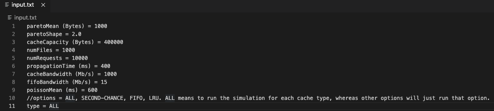
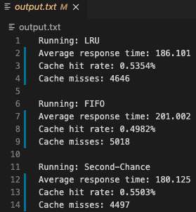

# CIS4930 Project
##### _Joseph Gravelle and Masen Beliveau_
***
###### Summary:
We have created a Network Cache Event-Driven Simulator for our final project. We coded our implementation in C++ and used LRU, FIFO, and Second Chance for our cache replacement policies. You can refer to the project report for more information about the project. For more information about the simulator and results, please read the [report PDF](https://github.com/jgravellefl/Network-Cache-Event-Driven-Simulator/blob/main/CIS4930%20Project%20Report.pdf).
***
###### How to run:
In the same directory as the source code, there is a makefile used to compile the program. Run `make` in the terminal, then open the output.txt to take a look at what the simulation returns (we assume that you have c++ installed in orde to compile). It will show information on each of the cache replacement policies to give you a comparison of the three. If you would like to change the inputs, go to the inputs.txt file and alter whatever values you would like. We recommend you change the following inputs:
* Pareto Shape
* Cache Capacity
* Number of Requests (numRequests)
* Poisson Mean
* FIFO Bandwidth
* Type
For example, you can switch __pareto shape__ from 2.0 to 3.0:

 

The other values can be changed, but they may cause nonconclusive results and dramatically increase the runtime.

If you are getting an error when running, you can try to add `-L/user/local/include` to the makefile in the second line under the compile section so that it is the following:

`g++ -L/user/local/include -lgsl main.o RemoteServer.o Cache.o LRUCache.o FIFOCache.o SecondChanceCache.o Event.o Constants.o FileRequestEvent.o FileSelection.o FileArriveEvent.o FileLeaveQueueEvent.o FileEnterQueueEvent.o`

###### System Requirements:
Requires C++ and the [GNU scientific library](https://www.gnu.org/software/gsl/).
***
###### Output:
In the output.txt file, you will see the cache replacement policy used in that run, followed by the average response time, cache hit ratet, and cache misses. For our report we would run the cache replacement policies through multiple iterations and get those averages to see overall what to expect from each policy, but the program will now only go through each requested cache replacement policy once. Here is an example output if __type__ is set to ALL:

 
